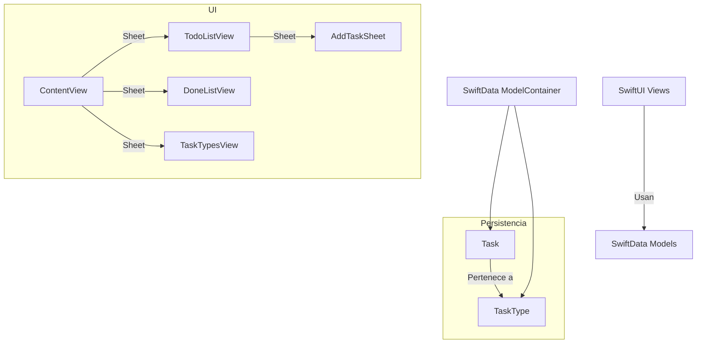

# KanbanLiteSnap

KanbanLiteSnap es una aplicación minimalista de gestión de tareas basada en el método Kanban, desarrollada en SwiftUI y SwiftData para macOS/iOS.

## Características principales
- Gestión de tareas por estados: Ideas (TODO), Focus (DOING), Achievements (DONE)
- Agrupación de tareas por tipo
- Persistencia local con SwiftData
- Interfaz moderna y reactiva con SwiftUI
- Añadir, mover y eliminar tareas y tipos
- Expansión/colapso de grupos de tareas

## Instalación y requisitos
- Xcode 15 o superior
- macOS 14/iOS 17 o superior (por uso de SwiftData)

Clona el repositorio:
```sh
git clone https://github.com/ntnglz/KanbanLiteSnap.git
```
Abre el proyecto en Xcode y ejecuta en el simulador o dispositivo.

## Uso básico
- Añade tipos de tarea desde el menú "Types"
- Añade nuevas ideas desde el botón "+" en la vista TODO
- Mueve tareas a Focus (DOING) o Achievements (DONE) con los botones de acción
- Elimina o restaura tareas desde la vista DONE

## Estructura del proyecto
- `Models/Task.swift`: Modelos de datos persistentes (Task, TaskType, TaskStatus)
- `Views/`: Vistas principales de la app (ContentView, TodoListView, DoneListView, TaskTypesView, AddTaskView)
- `ViewModels/`: (Legacy) Lógica de negocio previa a SwiftData
- `KanbanLiteSnapApp.swift`: Punto de entrada y configuración de SwiftData

## Créditos
Desarrollado por Antonio J. González y colaboradores.

## Licencia
MIT 

## Arquitectura



Las vistas principales usan los modelos persistentes `Task` y `TaskType` a través de SwiftData. Las tareas pueden pertenecer a un tipo. El contenedor de modelos de SwiftData gestiona la persistencia y la reactividad de los datos. 